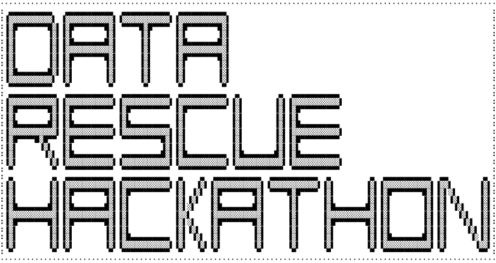

## A hackathon to build resilient research data rescue nodes that backup at-risk research data

The Trump administration has aggressively removed scientific and governmental research data from public access, purging thousands of web pages and datasets related to climate, health, demographics, LGBTQ + issues, and more — silently erasing vital knowledge that underpins scientific progress.

While some European institutions start backing up at-risk research data, the data rescue movement is driven by grassroots efforts like the [Data Rescue Project](https://www.datarescueproject.org) and the [Safeguarding Research](https://safeguar.de) initiative, who have mobilized volunteers, librarians, and scientists to download and archive these resources before they are lost forever.

The LMU Open Science Center is running a hackathon where we support, hands-on, the [safeguar.de](https://safeguar.de) project.

### Quick links

- [Announcement](announcements/LMU-Infodienst.md)
- [Schedule](Schedule.md)
- [Goals](Goals.md)
- [Registration Survey](Registration_survey.md)
- Tasks:
  - [Create a one-shot installation script for the SciOp data rescue node for a Raspberry Pi](tasks/one-shot-installation-script.md)
  - Create an full RPi image with all necessary software installed
 
### How to register ...
