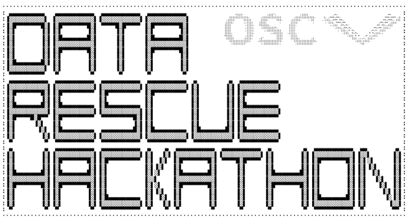
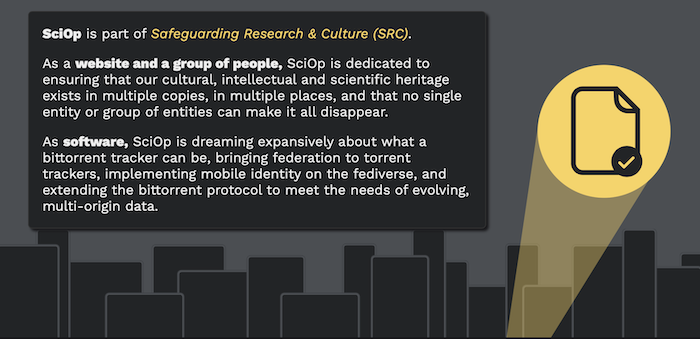

## A hackathon to build resilient research data rescue nodes that backup at-risk research data

The Trump administration has aggressively removed scientific and governmental research data from public access, purging thousands of web pages and datasets related to climate, health, demographics, LGBTQ + issues, and more — silently erasing vital knowledge that underpins scientific progress [[1]](https://www.ft.com/content/ccb0c850-f466-4b74-8c07-7d01230679a4) [[2]](https://www.newyorker.com/news/the-lede/the-data-hoarders-resisting-trumps-purge).

While some European institutions start backing up at-risk research data [[3]](https://www.uni-bremen.de/universitaet/hochschulkommunikation-und-marketing/pressemitteilungen/detailansicht/uni-bremen-und-awi-retten-wertvolle-wissenschaftliche-us-datenbanken) [[4]](https://absolutelymaybe.plos.org/2025/05/14/germanys-plan-for-an-open-and-independent-pubmed-safety-net/), the data rescue movement is driven by grassroots efforts like the [Data Rescue Project](https://www.datarescueproject.org) and the [Safeguarding Research](https://safeguar.de) initiative, who have mobilized volunteers, librarians, and scientists to download and archive these resources before they are lost forever.

The LMU Open Science Center is running a hackathon where we support, hands-on, the [safeguar.de](https://safeguar.de) project.

## 🚀 Join the LMU Open Science Center Hackathon

At this hands-on event, we welcome **Henrik Schönemann** (HU Berlin), an initiator of safeguar.de, for an ignition talk. In the practical part, we will directly support the data rescue efforts. Here’s what we aim to do together:

- **Learn & Build**: Install a BitTorrent client on your own machine to seed and safeguard critical research datasets.
- **Repurpose Old Hardware**: Turn old 2.5" HDDs, Raspberry Pis, or laptops into dedicated data rescue nodes by installing Linux and setting up archiving tools.
- **Improve Tools & Docs**: Write better documentation and develop one-click installation scripts to simplify deployment on any system.

📅 Thursday, 7.8.2025, 16:00 - 19:00 

📍 Leopoldstr. 13, 80802 Munich (exact location will be announced to registered participants)

## 🤝 Open to Everyone — Not Just Coders

While some parts are technical, we welcome everyone to contribute to: Outreach, documentation, coordination, creative ideas.

*Let’s work together to preserve scientific knowledge and build a resilient, community-powered data infrastructure.*

### Quick links

- [Schedule](Schedule.md)
- [Goals](Goals.md)
- [Signup Survey](Signup_survey.md)
- Tasks:
  - [Create a one-shot installation script for the SciOp data rescue node for a Raspberry Pi](tasks/one-shot-installation-script.md)
  - Create an full RPi image with all necessary software installed
- [Announcement](announcements/LMU-Infodienst.md)

### Tasks / Contributions

-   Gather abandoned hardware (RPis, laptops, external 2.5" HDDs, large 3.5" HDDs) - do this *before* the hackathon
-   Software development (see also [https://codeberg.org/Safeguarding/sciop/projects](https://codeberg.org/Safeguarding/sciop/projects))
    -   Linux/bash
    -   Python
    -   SQLite
    -   htmx
- Scrapign/crawling datasets using [browsertrix-crawler](https://crawler.docs.browsertrix.com) und [scrapy](https://www.scrapy.org)
-   Knowledge how to make macOS hardware capable to run Linux
-   Hardware knowledge, e.g.
    -   optimizing power consumption
    -   A solar/battery setup
-   Designing accessible documentation / tutorials (does not necessarily need technical knowledge; more creative and pedagogical skills)
-   Outreach & community management

### Material that we need

-   BYOD
-   Old Raspberry Pis
-   Old Micro-SD cards (at least 1 GB)
-   Old external HDDs
-   Old Laptops
-   Many Cables: Micro-USB --\> Mini-USB
-   Power strips
-   Tools (Mini-Screwdrivers)

---

- [1] [The fight to protect US data has begun](https://www.ft.com/content/ccb0c850-f466-4b74-8c07-7d01230679a4)
- [2] [The Data Hoarders Resisting Trump’s Purge: Can librarians and guerrilla archivists save the country’s files from DOGE?](https://www.newyorker.com/news/the-lede/the-data-hoarders-resisting-trumps-purge) 
- [3] [Uni Bremen und AWI retten wertvolle wissenschaftliche US-Datenbanken](https://www.uni-bremen.de/universitaet/hochschulkommunikation-und-marketing/pressemitteilungen/detailansicht/uni-bremen-und-awi-retten-wertvolle-wissenschaftliche-us-datenbanken)
- [4] [Germany’s Plan for an Open and Independent PubMed Safety Net](https://absolutelymaybe.plos.org/2025/05/14/germanys-plan-for-an-open-and-independent-pubmed-safety-net/)